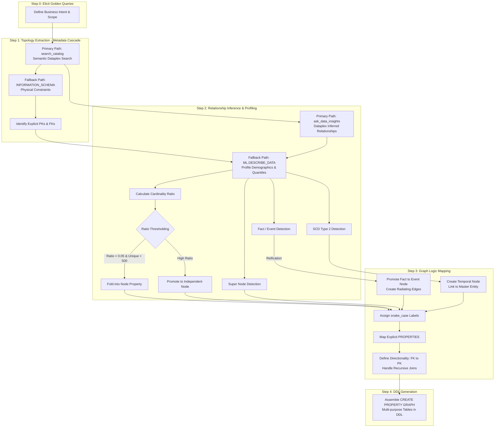

# BigQuery Property Graph Agent Skill (`bigquery-graphql`)

This skill provides expert guidance and an automated agent protocol for transforming existing BigQuery relational datasets into **Labeled Property Graphs (LPG)** and querying them using GQL (ISO standard). 

It allows an AI agent (like Gemini CLI connected to GCP MCP servers) to automatically translate relational data models into optimized graph topologies, execute performance heuristics, and write the final `CREATE PROPERTY GRAPH` DDL without moving or duplicating underlying data.

## TL;DR

The most robust strategy for building BigQuery LPGs combines hard schema boundaries with semantic catalog data and statistical inference. The naive approach—mapping every table to a node and every join to an edge—creates a bloated, unqueryable graph. By leveraging Data Catalog insights and data demographics via `ML.DESCRIBE_DATA`, your agent intelligently collapses low-cardinality lookup tables into node properties, promotes associative tables into edges, and executes advanced N-ary relationship reification for complex enterprise fact tables.

---

## Use Cases

Equip your agent with this skill when you need to automate:
1. **Relational-to-Graph Translation (99% of cases):** Analyze an existing BigQuery dataset, infer the logical graph topology (nodes, edges, properties), and generate the DDL to overlay a Property Graph on top of active tables.
2. **Unstructured Data Ingestion (1% of cases):** Ingest unstructured documents (PDF manuals, data sheets) from GCS, parse layouts via Document AI, extract entities using Gemini (`AI.GENERATE`) with strict JSON schemas, and stitch them into a property graph.
3. **High-Performance GQL Generation:** Write optimized Graph Query Language (GQL) statements that proactively handle data skew, cap super nodes, and utilize graph measures via `GRAPH_EXPAND` and `AGG()`.

---

## The Problem It Solves

Standard relational data warehouse models fail when directly converted to graphs by naive LLMs. This skill explicitly guides the agent to bypass three critical enterprise roadblocks:

*   **The Enforced Constraint Fallacy:** BigQuery datasets rarely use enforced physical foreign keys. Relying purely on `INFORMATION_SCHEMA` results in isolated nodes. This skill forces a metadata cascade to discover hidden logical joins.
*   **The Fact Table Trap:** Forcing a multi-dimensional retail fact table (e.g., `fact_demand` with 3+ foreign keys) into a single binary edge buries dimensions as edge properties, breaking graph navigation. This skill reifies fact tables into **Event Nodes** with radiating directional edges.
*   **The Measure Overcounting Engine Crash:** Running `GRAPH_EXPAND` on a universal enterprise graph with multiple root nodes (multiple fact tables) causes hard engine failures in BigQuery. Furthermore, standard joins duplicate parent rows. This skill enforces the generation of dedicated, single-root analytical graphs and locks aggregate properties directly to table keys using the `MEASURE()` keyword to eliminate overcounting.

---

## The 5-Step Automated Pipeline

The agent executes a strict, structured sequence to translate a relational model into an optimized logical graph layer:



### Step 0: Elicit Golden Queries
Before querying the database, the agent prompts the user for 1 to 3 "Golden Queries" (the direct business questions the graph must answer) and a target dataset boundary. The agent extracts business nouns (candidate nodes) and verbs (candidate edges) to prevent context blowout and scope the upstream search.

### Step 1: Topology Extraction (The Metadata Cascade)
The agent maps the dataset's structural boundaries using a smart fallback pattern. It preferentially utilizes semantic catalog tool searches to discover physical tables matching the business intent. If the catalog is unpopulated, it falls back to a targeted, bounded `INFORMATION_SCHEMA` search for explicit primary and foreign keys.

### Step 2: Relationship Inference & Statistical Profiling
The agent bypasses lack of physical constraints by fetching Dataplex-inferred logical relationships and lineage. If unavailable, it executes `ML.DESCRIBE_DATA` to look at row semantics. It uses hard statistical thresholds (cardinality ratio `< 0.05` and unique values `< 500`) to collapse low-cardinality metadata into **Node Properties** rather than bloat the graph with unnecessary lookup nodes. It also flags highly skewed data distributions for super node remediation.

### Step 3: Graph Logic Mapping
The agent translates profiled data into graph components. It maps Slowly Changing Dimensions (SCD Type 2) into temporal nodes keyed on `(id, effective_from)`. It maps metrics into explicit property lists—explicitly avoiding the performance-degrading `PROPERTIES ALL COLUMNS` clause—and enforces a strict `snake_case` naming protocol across all labels, aliases, and elements.

### Step 4: DDL Generation
The agent generates the final `CREATE OR REPLACE PROPERTY GRAPH` statement. It leverages BigQuery's native table multi-purposing capability, mapping a single underlying data warehouse table as both a node table and multiple edge tables simultaneously without data movement.

---

## Recommended MCP Servers & Extensions

To unleash the full power of this automated pipeline—specifically the high-speed "Metadata Cascade" loops—it is **highly recommended** that your Gemini CLI runtime is connected to the following extensions:

### 1. BigQuery Conversational Analytics Extension
Provides the semantic bridge tools (`search_catalog` and `ask_data_insights`). This enables the agent to search Dataplex glossaries using standard business terminology and query inferred logical schemas without running high-compute database scans.
```bash
gemini extensions install [https://github.com/gemini-cli-extensions/bigquery-conversational-analytics](https://github.com/gemini-cli-extensions/bigquery-conversational-analytics)
```

### 2. BigQuery Data Analytics Extension
Provides the raw execution environment for the agent to run structural queries (`INFORMATION_SCHEMA`), calculate statistical diagnostics (`ML.DESCRIBE_DATA`), deploy the final DDL statement, and test the performance of generated GQL paths.
```bash
gemini extensions install [https://github.com/gemini-cli-extensions/bigquery-data-analytics](https://github.com/gemini-cli-extensions/bigquery-data-analytics)
```