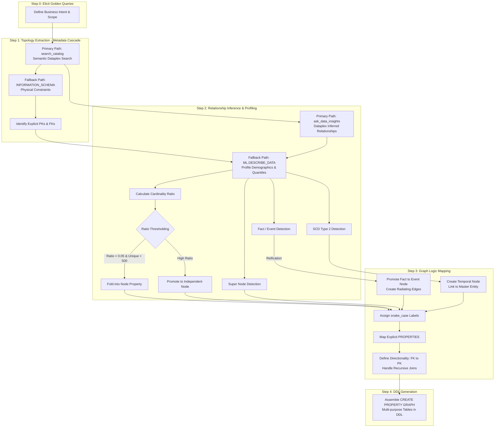

# BigQuery Property Graph, GQL & Automated Pipeline Translation

## TL;DR

The most robust strategy for building BigQuery Labeled Property Graphs (LPG) combines hard schema constraints with statistical inference and semantic metadata. The naive approach—mapping every table to a node and every join to an edge—creates a bloated, unqueryable graph. By profiling data with `ML.DESCRIBE_DATA` and leveraging Data Catalog insights, your agent can intelligently collapse low-cardinality lookup tables into node properties, promote associative tables into edges, and execute advanced N-ary relationship reification for complex enterprise fact tables.

Key principles:
* **Core Automated Pipeline (99% of Cases):** Execute a strict 5-step sequence over existing BigQuery tables: Elicit Golden Queries, Topology Extraction (MCP Cascade), Statistical Profiling (`ML.DESCRIBE_DATA`), Graph Logic Mapping, and DDL Generation.
* **Strict Snake Case Naming:** All graph objects (graphs, node labels, edge labels, table aliases, properties) must use `snake_case`. No uppercase or camelCase.
* **Logical Overlay:** BigQuery property graphs are DDL overlays (`CREATE PROPERTY GRAPH`). Data remains in your existing BigQuery relational tables or external object tables.
* **N-ary Relationship Reification (Fact/Event Nodes):** Never force fact tables with 3+ foreign keys (e.g., `fact_demand`, `fact_order_line`) into binary edges. Promote them to first-class **Event Nodes** and create radiating edges (`HAS_STORE`, `HAS_PRODUCT`, `HAS_WAREHOUSE`) to preserve multi-dimensional graph traversals.
* **Slowly Changing Dimensions (SCD Type 2):** Model historical snapshot tables (e.g., `product_pack_history`) as dedicated **Temporal Nodes** keyed on `(id, effective_from)` and link them back to master entities to enable time-travel graph queries.
* **Multi-purposing Tables in DDL:** Leverage BigQuery's ability to define a single underlying table multiple times in `NODE TABLES` and `EDGE TABLES` to represent both the event node and its radiating relationships without duplicating data.
* **Explicit Property Scoping:** Never use `PROPERTIES ALL COLUMNS`. Explicitly scope property lists based on variance and cardinality to prevent unneeded column scans.
* **Query Optimization & Super Nodes:** Enforce directional traversals, filter starting nodes by low cardinality, specify labels explicitly, and handle high-cardinality "super nodes" using `ROW_NUMBER()` filtering.
* **Graph Measures & Exact Aggregation:** Define aggregate properties (`SUM`, `AVG`, `COUNT`, etc.) locked to table keys to prevent overcounting across joins, querying them via `GRAPH_EXPAND` and `AGG()`.
* **Unstructured Ingestion (1% of Cases):** Employs a Hybrid AI workflow pairing Document AI Layout Parser (`ML.PROCESS_DOCUMENT`) with Gemini (`AI.GENERATE`) using strict output schemas.

> [!IMPORTANT]
> BigQuery implements a **Labeled Property Graph (LPG)** model as a logical layer. You do not move or duplicate your data. You define a schema that tells BigQuery how to interpret your existing tables as nodes and edges.

---

## 1. Graph Database Modeling Best Practices

When moving from a relational mindset to a graph mindset, the focus shifts from entities and joins to entities (nodes) and their relationships (edges).

* **Think in Nouns, Verbs, and Events (Reification):**
  * **Master Nodes (Nouns):** Core entities in your domain (e.g., `customer`, `product`, `store`, `warehouse`). In a relational model, these are typically your main dimension tables containing a single primary key.
  * **Event / Fact Nodes (Reified N-ary Relationships):** Transactional or event tables containing 3+ foreign keys and extensive metrics (e.g., `fact_demand`, `fact_order_line`). In LPGs, edges are strictly binary (`Source -> Destination`). Forcing a multi-dimensional fact table into a single binary edge buries the remaining dimensions as edge properties, destroying graph navigation. Promoting fact tables to Event Nodes with radiating edges preserves full multi-hop traversal across all dimensions.
  * **Temporal Nodes (SCD Type 2 History):** Historical dimension tables tracking changes over time (e.g., `product_pack_history` keyed on `item_id, effective_from`). Model these as standalone nodes linked back to the master entity (`HAS_PACK_PERIOD`) to support temporal graph analysis.
  * **Edges (Verbs & Radiating Links):** Relationships between nodes. These include pure binary associative tables (e.g., `ships_to` between warehouse and store) as well as radiating structural links originating from Event Nodes (e.g., `Demand` `-[HAS_STORE]->` `Store`).
* **Properties Describe Nodes and Edges:** Both nodes and edges can have key-value pairs called properties.
  * **Node Properties:** Attributes of the entity or event (e.g., a `Demand` node has `projected_demand`, `units_sold`, `gross_revenue`).
  * **Edge Properties:** Attributes of the relationship (e.g., a `ships_to` edge has `transit_days`, `is_primary`).
* **Explicit Property Scoping (Crucial for Performance):** Avoid `PROPERTIES ALL COLUMNS` or default syntax that attaches all table columns to the graph element. Explicitly list only the necessary properties using `PROPERTIES (id, name, balance)` to prevent unneeded column scans during graph queries.
* **Define Primary & Foreign Key Constraints:** Define `PRIMARY KEY (id) NOT ENFORCED` on node tables, and `PRIMARY KEY (...) NOT ENFORCED`, `FOREIGN KEY (...) REFERENCES ... NOT ENFORCED` on edge tables. BigQuery uses these constraints to optimize graph queries by pruning unnecessary table scans. (Ensure your ELT pipelines maintain referential integrity).
* **Use Labels Effectively:** Labels serve as the "type" for nodes and edges. Use distinct, descriptive snake_case labels for nodes and edges to clearly define entity and relationship types.

---

## 2. The Core Automated Agent Pipeline (Relational-to-Graph - 99% of Cases)

Because BigQuery data warehouses often rely on logical (unenforced) relationships rather than physical foreign keys, an automated agent or MCP server cannot rely on schema definitions alone. It must combine hard structural boundaries with statistical data demographics and the user's specific business context to infer the optimal graph topology (De Virgilio et al., 2013).

Whenever an agent is tasked with creating a BigQuery Property Graph over existing relational tables, it MUST execute the following strict 5-step sequence. **You must execute Step 1 via your BigQuery query tool and WAIT for the results. Do not proceed to Step 2 until Step 1 data is in context. Do not write DDL until ML.DESCRIBE_DATA results have been successfully returned.**



### Step 0: Elicit Golden Queries
Before touching the database, always prompt the user for their "Golden Queries" (the business questions the graph must answer) along with a specific dataset boundary or core entity list to scope your search.

### Step 1: Topology Extraction (The Metadata Cascade)
Your agent maps the structural boundaries using a "smart fallback" pattern to prevent context blowout and leverage Dataplex business metadata.
* **Primary Path (The Smart Path):** Pass the user's Golden Queries directly into the `mcp_bigquery_conversational_analytics_search_catalog` tool. This Knowledge/Data Catalog search returns semantically relevant tables, their Dataplex business descriptions, and tags, instantly translating obscure table names (e.g., finding `t_loc_dim_88` when asked for "Stores").
* **Secondary Path (The Brute Force Fallback):** If the catalog search is empty or descriptions are missing, fallback to querying BigQuery's internal schema catalogs. **Never run an unbounded `INFORMATION_SCHEMA` query across an entire project.** Use the boundaries defined in Step 0.
  * Query `INFORMATION_SCHEMA.TABLE_CONSTRAINTS` and `INFORMATION_SCHEMA.KEY_COLUMN_USAGE` to identify explicit Primary Keys (PK) and Foreign Keys (FK).
  * **Master Dimension Nodes:** Tables possessing a primary key and zero or one foreign key.
  * **Candidate Link Tables:** Tables containing 2 or more foreign keys.

```sql
-- Fallback Query for Topology Extraction
SELECT 
  tc.table_name, 
  tc.constraint_type, 
  kcu.column_name
FROM my_dataset.INFORMATION_SCHEMA.TABLE_CONSTRAINTS tc
JOIN my_dataset.INFORMATION_SCHEMA.KEY_COLUMN_USAGE kcu
  ON tc.constraint_name = kcu.constraint_name
WHERE tc.constraint_type IN ('PRIMARY KEY', 'FOREIGN KEY');
```

### Step 2: Relationship Inference & Statistical Profiling
BigQuery `INFORMATION_SCHEMA` only shows enforced physical constraints. Dataplex automatically infers logical foreign keys, primary keys, and data lineage behind the scenes.
* **Primary Path (The Dataplex Cheat Code):** Use the `mcp_bigquery_conversational_analytics_ask_data_insights` tool to query the Conversational Analytics API. Ask it directly: *"Based on the catalog metadata, what are the primary keys, foreign keys, and joining logic between the [X] and [Y] tables?"* This bypasses statistical guesswork by retrieving verified Dataplex-inferred logical relationships.
* **Secondary Path (Brute Force Profiling):** If the Conversational API cannot determine the relationships, fallback to executing `ML.DESCRIBE_DATA` against the candidate tables to infer the topology:
```sql
SELECT * FROM ML.DESCRIBE_DATA(
  TABLE my_dataset.orders,
  STRUCT(5 AS num_quantiles, 10 AS top_k)
);
```

The agent evaluates the demographic output across six dimensions:
1. **Cardinality Ratio:** Calculate the uniqueness of each column:
   $$\text{Ratio} = \frac{\text{unique\_values}}{\text{total\_rows}}$$
2. **Property vs. Node Thresholding:** If the cardinality ratio is < 0.05 AND total unique values are < 500, fold it into a Node Property. Otherwise, promote to an independent Node (Shahzad, 2020).
3. **Fact / Event Detection (N-ary Reification):** Inspect candidate link tables with 2+ FKs. If the table exhibits high row volume and contains numerous numeric metric columns (e.g., `projected_demand`, `units_sold`, `ordered_quantity`), flag it as a **Fact / Event Table** requiring N-ary reification.
4. **SCD Type 2 Temporal Detection:** Inspect tables with composite keys containing date/timestamp columns (`effective_from`, `start_date`). Flag them as **Temporal Nodes** tracking historical dimension changes.
5. **Hidden FK Discovery:** Columns ending in `_id` or matching master table key patterns whose `unique_values` count closely matches the `total_rows` count of another table in the dataset are flagged as inferred foreign keys.
6. **Super Node Detection:** Inspect frequency counts (`top_values.count`) on foreign key columns. If a small number of keys exhibit wildly disproportionate counts (e.g., a customer with 100,000+ orders), flag the entity as a **super node** (hub node) requiring downstream `ROW_NUMBER()` capping.

### Step 3: Graph Logic Mapping (Relational to Property Graph)
Translate the extracted and profiled metadata into BigQuery Graph concepts (Shute, 2026).
* **Labels:** Assign distinct, descriptive `snake_case` labels using the base table names.
* **N-ary Reification Mapping:** For flagged Fact/Event tables (e.g., `fact_demand`), map the table as a central **Node Table** containing all metric properties. Then, define dedicated radiating **Edge Tables** originating from the Event Node to each participating dimension table (`HAS_STORE`, `HAS_PRODUCT`, `HAS_WAREHOUSE`).
* **Temporal Node Mapping:** For SCD Type 2 tables (e.g., `product_pack_history`), map them as standalone Node Tables keyed on `(id, effective_from)` and define an outgoing structural edge linking them back to the master entity (`HAS_PACK_PERIOD`).
* **Properties:** Map the remaining non-key, low-cardinality columns within the `PROPERTIES()` clause, ensuring high-sparsity or zero-variance columns are excluded.
* **Directionality:** Define edge directionality flowing strictly from the FK source to the PK target (`-[edge]->`). Ensure recursive navigational properties are handled as standard relational joins to maintain query tractability (Francis & Libkin, 2017).

### Step 4: DDL Generation (Build CREATE PROPERTY GRAPH)
Assemble the validated components into an executable `CREATE OR REPLACE PROPERTY GRAPH` DDL statement. Leverage BigQuery's multi-purposing capability to reference the same underlying table in both `NODE TABLES` and `EDGE TABLES` without duplicating data.

```sql
CREATE OR REPLACE PROPERTY GRAPH my_dataset.enterprise_supply_chain_graph
  NODE TABLES (
    my_dataset.store_master AS store 
      KEY (store_id) 
      LABEL store 
      PROPERTIES (store_id, name, city),
    my_dataset.product_master AS product 
      KEY (item_id) 
      LABEL product 
      PROPERTIES (item_id, description, category),
    my_dataset.fact_demand AS demand
      KEY (store_id, item_id, forecast_week)
      LABEL demand
      PROPERTIES (forecast_week, projected_demand, units_sold)
  )
  EDGE TABLES (
    my_dataset.fact_demand AS demand_has_store
      KEY (store_id, item_id, forecast_week)
      SOURCE KEY (store_id, item_id, forecast_week) REFERENCES demand(store_id, item_id, forecast_week)
      DESTINATION KEY (store_id) REFERENCES store(store_id)
      LABEL has_store,
    my_dataset.fact_demand AS demand_has_product
      KEY (store_id, item_id, forecast_week)
      SOURCE KEY (store_id, item_id, forecast_week) REFERENCES demand(store_id, item_id, forecast_week)
      DESTINATION KEY (item_id) REFERENCES product(item_id)
      LABEL has_product
  );
```

---

## 2.5 Alternative Workflow: Unstructured "Dark Data" Ingestion (1% of Cases)

While 99% of enterprise graphs are built over structured relational tables, valuable domain knowledge is occasionally buried in unstructured PDFs (manuals, datasheets). To convert dark data into a property graph, execute a Hybrid AI pipeline:

1. **Create an Object Table (Bronze Layer):** Expose GCS unstructured files to BigQuery using an external object table (`CREATE OR REPLACE EXTERNAL TABLE ... WITH CONNECTION ... OPTIONS (object_metadata = 'SIMPLE', uris = ['gs://.../*.pdf'])`).
2. **Connect to Document AI Layout Parser:** Create a remote model pointing to a Document AI Layout Parser processor (`CLOUD_AI_DOCUMENT_V1`). This specialized parser preserves tables, lists, and multi-column layouts that collapse in basic OCR.
3. **Parse and Chunk (Silver Layer):** Call `ML.PROCESS_DOCUMENT` to parse PDFs into structured chunks (adhering to the 130-page / 120-second timeout limits).
4. **Extract Entities & Relationships with Gemini:** Pass parsed chunks to Gemini (`AI.GENERATE`). Enforce a strict JSON structure using `output_schema` to guarantee deterministic results without regex hacking.
   ```sql
   output_schema => '{"relationships": ARRAY<STRUCT<subject STRING STRING, object object_type relationship subject_type>>}'
   
```
5. **Extract Node & Edge Tables:** Unnest the resulting JSON arrays, slice them into dedicated tables for Nodes and Edges, run `ML.DESCRIBE_DATA` profiling, and stitch them into `CREATE PROPERTY GRAPH`.

---

## 3. Advanced Graph Schema & Query Best Practices

To ensure your GQL queries execute efficiently over millions of nodes and billions of edges, apply these official BigQuery Graph optimization rules:

### 3.1. Start Path Traversal from Low-Cardinality Nodes
Always start path traversals from the most restrictive, lowest-cardinality nodes using inline property filters or `WHERE` clauses. This keeps intermediate result sets small, regardless of traversal direction.
```sql
-- Preferred: Filter starting node immediately
MATCH (p:person {id: 10})-[own:owns]->{1,3}(a:account)
```

### 3.2. Use ANY or ANY SHORTEST for Connectivity Checks
Quantified path queries (e.g., `->{1,5}`) can generate massive numbers of duplicate paths between node pairs. If your goal is simply to check reachability or connectivity rather than listing every permutation, use `ANY` or `ANY SHORTEST` to prune redundant computations.
```sql
-- Preferred for reachability checks
MATCH ANY SHORTEST (a1:account)-[t:transfers]->{1,4}(a2:account)
```

### 3.3. Enforce Directional Path Traversal
BigQuery Graph schemas are strictly directional. While GQL allows bi-directional or any-direction syntax (`-[edge]-`), querying without directionality severely degrades performance. Always use directional arrows (`-[edge]->` or `<-[edge]-`). If you must check both directions, combine two directional queries with `UNION ALL`.
```sql
-- Avoid:
MATCH (a1:account {id: 7})-[t:transfers]-(a2:account)

-- Preferred:
MATCH (a1:account {id: 7})-[t:transfers]->(a2:account)
UNION ALL
MATCH (a1:account {id: 7})<-[t:transfers]-(a2:account)
```

### 3.4. Specify Labels Explicitly
Omitting node or edge labels forces BigQuery Graph to enumerate and scan all qualifying table labels and unneeded relationships in the graph. Always specify explicit labels for every node and edge in your pattern.
```sql
-- Avoid: Omitting labels scans unneeded tables
MATCH (a1)-[t]->(a2)

-- Preferred: Explicitly targets Account and Transfers tables
MATCH (a1:account)-[t:transfers]->(a2:account)
```

### 3.5. Prefer a Single MATCH Statement
Multiple `MATCH` clauses in a single query diminish the optimizer's cardinality pruning benefits across statements. Chain patterns within a single `MATCH` statement whenever possible.
```sql
-- Avoid: Multiple MATCH statements
MATCH (p:person {id: 1})-[o:owns]->(a:account)
MATCH (a:account)-[t:transfers]->(a2:account)

-- Preferred: Single chained MATCH statement
MATCH (p:person {id: 1})-[o:owns]->(a:account)-[t:transfers]->(a2:account)
```

### 3.6. Limit Traversed Edges from High-Cardinality "Super Nodes"
Real-world graphs often contain "super nodes" or "hub nodes" (e.g., a major retail bank account with millions of transactions). Traversing through super nodes creates severe data skew and slow query execution. Once proactively identified during the build phase using `ML.DESCRIBE_DATA`'s `top_values` output, use the `ROW_NUMBER()` function within a `FILTER` or `WHERE` clause inside `MATCH` to cap the number of traversed edges when full enumeration isn't required.
```sql
-- Preferred: Sample top 5 transfer edges per source account
MATCH (a1:account)-[e1:transfers WHERE e1 IN {
  GRAPH my_dataset.fin_graph
  MATCH -[selected_e:transfers]->
    FILTER ROW_NUMBER() OVER (PARTITION BY SOURCE_NODE_ID(selected_e)) < 5
  RETURN selected_e
}]->{1,3}(a2:account)
```

### 3.7. Sample Intermediate Nodes in Multi-Hop Queries
For complex multi-hop queries, break the query into multiple `MATCH` statements separated by `NEXT`, and apply `ROW_NUMBER()` filtering to sample intermediate nodes and prevent exponential path explosion.
```sql
MATCH (a1:account)-[e1:transfers]->(a2:account)
FILTER ROW_NUMBER() OVER (PARTITION BY ELEMENT_ID(a1)) < 5
RETURN a1, a2
NEXT
MATCH (a2)-[e2:transfers]->(a3:account)
RETURN a1.id AS src_id, a2.id AS mid_id, a3.id AS dst_id;
```

---

## 4. Graph Measures & Exact Aggregations

In relational joins involving one-to-many relationships, parent data is duplicated across rows. If you calculate a standard `SUM()` over joined data, parent values are overcounted. BigQuery Graph solves this elegantly using **Measures**.

### 4.1. Defining Measures
A measure is an aggregate property defined inside the `PROPERTIES` clause of a node or edge table using the `MEASURE()` keyword and a supported aggregate function (`SUM`, `AVG`, `COUNT`, `COUNT(DISTINCT)`, `MIN`, `MAX`). Measures lock their aggregation directly to the table `KEY`.
```sql
PROPERTIES (
  dept_id, dept_name, budget,
  MEASURE(SUM(budget)) AS total_budget
)
```

### 4.2. Querying Measures (GRAPH_EXPAND + AGG)
You cannot reference a measure property directly in GQL `MATCH` queries. Instead, you access measures by calling the `GRAPH_EXPAND` table-valued function (TVF) to flatten the graph into a table, and wrapping the measure column in the `AGG()` function.

* **The Single Root Limitation (CRITICAL):** `GRAPH_EXPAND` applies a series of `LEFT JOIN` operations and strictly requires the input graph to have **exactly one root node table** (a table whose `KEY` does not appear as a foreign key in any other table). 
* **Dedicated Analytical Graphs:** Real-world enterprise graphs often contain multiple fact tables (e.g., `fact_demand`, `fact_order_line`), meaning they have multiple roots. If a user requests a measure aggregation over a multi-fact environment, the agent MUST generate a dedicated, single-root Property Graph centered purely on the target fact table (e.g., `CREATE PROPERTY GRAPH demand_measures_graph...`) before executing `GRAPH_EXPAND`.
* **Column Naming:** Flattened columns are named `<TableLabel>_<property_name>` (e.g., `demand_sum_gross_revenue`).
* **The `AGG()` Wrapper:** Wrapping the measure in `AGG(demand_sum_gross_revenue)` guarantees the aggregation executes exactly once per key, completely eliminating overcounting.
* **Caching Caution:** Changes to underlying graph tables do not invalidate cached results for `GRAPH_EXPAND`. Always disable cached results retrieval when calling `GRAPH_EXPAND` in production pipelines.
* **Inspecting Schema:** To view the flattened schema without running the TVF, execute the system procedure:
  ```sql
  DECLARE schema STRING DEFAULT '';
  CALL BQ.SHOW_GRAPH_EXPAND_SCHEMA('my_dataset.my_graph', schema);
  SELECT schema;
  
```

---

## 5. AI Integration, Vector Search & Visualization

BigQuery Graph integrates seamlessly with Vertex AI and BigQuery ML, bridging structured graphs and semantic AI.

### 5.1. Vector Search + Graph Traversal
You can combine `VECTOR_SEARCH` over node embeddings with GQL multi-hop traversals to discover complex patterns (e.g., finding accounts semantically similar to a known fraud profile, then tracing their transaction network).
```sql
DECLARE similar_suspects DEFAULT ((
  SELECT ARRAY_AGG(base.id)
  FROM VECTOR_SEARCH(
    TABLE my_dataset.account_table, 'embedding',
    (SELECT * FROM my_dataset.account_table WHERE id = 102), 'embedding',
    top_k => 5
  )
));

GRAPH my_dataset.fin_graph
MATCH (p:person)-[o:owns]->(a:account)-[t:transfers]->{1,4}(dest:account)
WHERE dest.id IN UNNEST(similar_suspects)
RETURN p.id AS person_id, a.id AS src_account, dest.id AS dest_account;
```

### 5.2. Visualization
* **BigQuery Studio & Jupyter Notebooks:** Natively render graph query results as interactive visual networks.
* **Partner Integrations:** Export or connect BigQuery Graph directly to enterprise graph visualization platforms including **G.V()**, **Graphistry**, **Kineviz**, and **Linkurious** for advanced visual investigation.

---

## 6. Production-Grade Implementation Examples

### Example 1: Enterprise Supply Chain & Retail Graph (N-ary Reification & SCD Type 2)
Demonstrates the complete automated agent sequence for an advanced enterprise supply chain: capturing business intent, extracting topology via MCP Data Catalog tools, profiling demographics to handle scale, reifying multi-dimensional fact tables into event nodes, generating multi-purposed DDL, and querying.

```sql
-- ==========================================
-- STEP 0: ELICIT GOLDEN QUERIES
-- ==========================================
-- Agent Prompts User: "What are the core business questions this graph needs to answer?"
-- User Input: "Find fulfillment gaps for products with recent pack size changes across stores served by Central_DC."
-- Agent extracts Nouns (Candidate Nodes): 'product', 'pack size', 'store', 'warehouse'
-- Agent extracts Verbs (Candidate Edges): 'fulfillment gap', 'changes', 'served by'

-- ==========================================
-- STEP 1: METADATA EXTRACTION (MCP First)
-- ==========================================
-- Agent uses Conversational Analytics MCP to find semantic matches without brute-force scanning.
-- ACTION: Call `mcp_bigquery_conversational_analytics_search_catalog`
-- PAYLOAD: {"query": "product, store, warehouse, fulfillment, pack size"}
-- RESULT: Identifies `product_master`, `store_master`, `dim_warehouse`, `fact_order_line`, `product_pack_history`, `fact_demand`.

-- ACTION: Call `mcp_bigquery_conversational_analytics_ask_data_insights`
-- PAYLOAD: {"question": "What are the join keys and logical relationships connecting store_master, product_master, dim_warehouse, and fact_demand?"}
-- RESULT: API returns verified logical schema—fact_demand has 3 foreign keys (store_id, item_id, warehouse_id) and high volume metrics. 

-- ==========================================
-- STEP 2: STATISTICAL PROFILING
-- ==========================================
-- Agent profiles the heavily referenced tables to evaluate cardinality ratios, metrics, and temporal keys.
SELECT * FROM ML.DESCRIBE_DATA(
  TABLE my_dataset.fact_demand,
  STRUCT(5 AS num_quantiles, 10 AS top_k)
);

-- Analysis confirms 'fact_demand' metrics (projected_demand, units_sold). Agent flags it for N-ary Reification.
-- Analysis reveals 'product_pack_history' has a composite key with 'effective_from'. Agent flags it as an SCD Type 2 Temporal Node.

-- ==========================================
-- STEP 3 & 4: LOGIC MAPPING & DDL GENERATION
-- ==========================================
-- Agent constructs the CREATE PROPERTY GRAPH DDL using multi-purposed tables for reified event nodes and radiating edges.
CREATE OR REPLACE PROPERTY GRAPH my_dataset.enterprise_supply_chain_graph
NODE TABLES (
  my_dataset.product_master AS product
    KEY (item_id)
    LABEL product
    PROPERTIES (item_id, description, category, department, pack_qty),
  my_dataset.store_master AS store
    KEY (store_id)
    LABEL store
    PROPERTIES (store_id, name, city, state, district),
  my_dataset.dim_warehouse AS warehouse
    KEY (warehouse_id)
    LABEL warehouse
    PROPERTIES (warehouse_id, name, city, state, capacity),
  my_dataset.fact_demand AS demand
    KEY (store_id, item_id, forecast_week)
    LABEL demand
    PROPERTIES (
      forecast_week, projected_demand, demand_p05, demand_p95, 
      units_sold, gross_revenue, net_revenue, ordered_units, shipped_units,
      MEASURE(SUM(gross_revenue)) AS sum_gross_revenue,
      MEASURE(SUM(units_sold)) AS sum_units_sold
    ),
  my_dataset.fact_order_line AS order_line
    KEY (order_number, item_id)
    LABEL order_line
    PROPERTIES (order_number, shipment_date, ordered_qty, shipped_qty, gap_units),
  my_dataset.dim_promotion AS promotion
    KEY (promotion_id)
    LABEL promotion
    PROPERTIES (promotion_id, promotion_name, discount_pct, start_date, end_date),
  my_dataset.product_pack_history AS product_pack_period
    KEY (item_id, effective_from)
    LABEL product_pack_period
    PROPERTIES (item_id, effective_from, effective_to, pack_size, uom)
)
EDGE TABLES (
  -- Radiating edges from Reified Demand Event Node
  my_dataset.fact_demand AS demand_has_store
    KEY (store_id, item_id, forecast_week)
    SOURCE KEY (store_id, item_id, forecast_week) REFERENCES demand(store_id, item_id, forecast_week)
    DESTINATION KEY (store_id) REFERENCES store(store_id)
    LABEL has_store,
  my_dataset.fact_demand AS demand_has_product
    KEY (store_id, item_id, forecast_week)
    SOURCE KEY (store_id, item_id, forecast_week) REFERENCES demand(store_id, item_id, forecast_week)
    DESTINATION KEY (item_id) REFERENCES product(item_id)
    LABEL has_product,
  my_dataset.fact_demand AS demand_has_warehouse
    KEY (store_id, item_id, forecast_week)
    SOURCE KEY (store_id, item_id, forecast_week) REFERENCES demand(store_id, item_id, forecast_week)
    DESTINATION KEY (warehouse_id) REFERENCES warehouse(warehouse_id)
    LABEL has_warehouse,

  -- Radiating edges from Reified Order Line Event Node
  my_dataset.fact_order_line AS order_line_at_store
    KEY (order_number, item_id)
    SOURCE KEY (order_number, item_id) REFERENCES order_line(order_number, item_id)
    DESTINATION KEY (store_id) REFERENCES store(store_id)
    LABEL ordered_at,
  my_dataset.fact_order_line AS order_line_for_product
    KEY (order_number, item_id)
    SOURCE KEY (order_number, item_id) REFERENCES order_line(order_number, item_id)
    DESTINATION KEY (item_id) REFERENCES product(item_id)
    LABEL for_product,

  -- Associative & Structural Edges
  my_dataset.dim_dc_store_assignment AS ships_to
    KEY (warehouse_id, store_id)
    SOURCE KEY (warehouse_id) REFERENCES warehouse(warehouse_id)
    DESTINATION KEY (store_id) REFERENCES store(store_id)
    LABEL ships_to PROPERTIES (is_primary, transit_days),
  my_dataset.edge_warehouse_stocks_product AS stocks
    KEY (warehouse_id, item_id)
    SOURCE KEY (warehouse_id) REFERENCES warehouse(warehouse_id)
    DESTINATION KEY (item_id) REFERENCES product(item_id)
    LABEL stocks PROPERTIES (available_qty, allocated_qty),
  my_dataset.edge_promotion_applies_to_product AS promo_applies_product
    KEY (promotion_id, item_id)
    SOURCE KEY (promotion_id) REFERENCES promotion(promotion_id)
    DESTINATION KEY (item_id) REFERENCES product(item_id)
    LABEL applies_to PROPERTIES (expected_lift_pct, promo_price),
  my_dataset.product_pack_history AS product_has_pack_period
    KEY (item_id, effective_from)
    SOURCE KEY (item_id, effective_from) REFERENCES product_pack_period(item_id, effective_from)
    DESTINATION KEY (item_id) REFERENCES product(item_id)
    LABEL has_pack_period
);

-- ==========================================
-- STEP 5: GQL & MEASURE QUERIES
-- ==========================================
-- GQL Query: Multi-hop traversal finding fulfillment gaps for products with recent pack size changes across stores served by a specific warehouse
GRAPH my_dataset.enterprise_supply_chain_graph
MATCH (w:warehouse {name: "Central_DC"})-[st:ships_to]->(s:store)
MATCH (s)<-[oas:ordered_at]-(ol:order_line {gap_units > 0})-[fop:for_product]->(p:product)<-[hpp:has_pack_period]-(ppp:product_pack_period)
WHERE ppp.effective_from >= '2026-01-01'
RETURN w.name, s.name, p.description, ol.gap_units, ppp.pack_size;

-- Measure Query: Exact aggregation using GRAPH_EXPAND and AGG()
-- CRITICAL: Because the main graph has multiple roots (demand, order_line), GRAPH_EXPAND will fail. 
-- The agent must create a dedicated single-root analytical graph for the measure.
CREATE OR REPLACE PROPERTY GRAPH my_dataset.demand_analytical_graph
NODE TABLES (
  my_dataset.store_master AS store 
    KEY (store_id) LABEL store PROPERTIES (district),
  my_dataset.fact_demand AS demand 
    KEY (store_id, item_id, forecast_week) LABEL demand
    PROPERTIES (
      MEASURE(SUM(gross_revenue)) AS sum_gross_revenue,
      MEASURE(SUM(units_sold)) AS sum_units_sold
    )
)
EDGE TABLES (
  my_dataset.fact_demand AS demand_has_store
    KEY (store_id, item_id, forecast_week)
    SOURCE KEY (store_id, item_id, forecast_week) REFERENCES demand(store_id, item_id, forecast_week)
    DESTINATION KEY (store_id) REFERENCES store(store_id)
    LABEL has_store
);

-- Execute exact aggregation against the dedicated single-root graph
SELECT
  store_district,
  AGG(demand_sum_gross_revenue) AS exact_district_demand_revenue,
  AGG(demand_sum_units_sold) AS exact_district_units_sold
FROM GRAPH_EXPAND("my_dataset.demand_analytical_graph")
GROUP BY store_district;
```

### Example 2: Unstructured "Dark Data" Manufacturing Knowledge Graph
Demonstrates extracting entities and relationships from PDFs and stitching them into a graph ontology.

```sql
-- 1. Bronze Layer: Expose GCS PDFs via Object Table
CREATE OR REPLACE EXTERNAL TABLE my_dataset.raw_manuals
WITH CONNECTION `us.vertex-conn`
OPTIONS (object_metadata = 'SIMPLE', uris = ['gs://my-bucket/manuals/*.pdf']);

-- 2. Silver Layer: Connect DocAI Layout Parser Remote Model
CREATE OR REPLACE MODEL my_dataset.docai_layout_parser
REMOTE WITH CONNECTION `us.vertex-conn`
OPTIONS (remote_service_type = 'CLOUD_AI_DOCUMENT_V1', document_processor = 'your_layout_processor_id');

-- 3. Silver Layer: Parse Documents into Structured Chunks
CREATE OR REPLACE TABLE my_dataset.parsed_manuals AS
SELECT * FROM ML.PROCESS_DOCUMENT(
  MODEL my_dataset.docai_layout_parser,
  TABLE my_dataset.raw_manuals
);

-- 4. Silver Layer: Extract Entities & Relationships using Gemini with strict output_schema
CREATE OR REPLACE TABLE my_dataset.extracted_kg_raw AS
SELECT uri, rel.*
FROM (
  SELECT uri, AI.GENERATE(
    """
    You are an expert technical knowledge graph extractor.
    TASK: Extract ALL component relationships from the provided text.
    VALID ENTITIES: Product, Part, Material.
    VALID RELATIONSHIPS:
    - CONTAINS_PART: (Product) -> (Part)
    - MADE_OF: (Part) -> (Material)
    """ || content,
    output_schema => '{"relationships": ARRAY<STRUCT<subject STRING STRING, object object_type relationship subject_type>>}',
    endpoint => '[https://aiplatform.googleapis.com/v1/projects/your-project-id/locations/global/publishers/google/models/gemini-3.1-pro-preview](https://aiplatform.googleapis.com/v1/projects/your-project-id/locations/global/publishers/google/models/gemini-3.1-pro-preview)'
  ) AS ai_out
  FROM my_dataset.parsed_manuals
), UNNEST(ai_out.relationships) AS rel;

-- 5. Silver Layer: Slicing into dedicated Node and Edge Tables
CREATE OR REPLACE TABLE my_dataset.part_nodes AS
SELECT DISTINCT subject AS part_name FROM my_dataset.extracted_kg_raw WHERE subject_type = 'Part';

CREATE OR REPLACE TABLE my_dataset.material_nodes AS
SELECT DISTINCT object AS material_name FROM my_dataset.extracted_kg_raw WHERE object_type = 'Material';

CREATE OR REPLACE TABLE my_dataset.part_material_edges AS
SELECT subject AS part_name, object AS material_name FROM my_dataset.extracted_kg_raw WHERE relationship = 'MADE_OF';

-- 6. Pre-Build Demographic Profiling via ML.DESCRIBE_DATA
SELECT * FROM ML.DESCRIBE_DATA(
  TABLE my_dataset.part_material_edges,
  STRUCT(5 AS num_quantiles, 10 AS top_k)
);

-- 7. Gold Layer: CREATE PROPERTY GRAPH DDL
CREATE OR REPLACE PROPERTY GRAPH my_dataset.manufacturing_kg
NODE TABLES (
  my_dataset.part_nodes AS part_node
    KEY (part_name)
    LABEL part
    PROPERTIES (part_name),
  my_dataset.material_nodes AS material_node
    KEY (material_name)
    LABEL material
    PROPERTIES (material_name)
)
EDGE TABLES (
  my_dataset.part_material_edges AS part_material_edge
    SOURCE KEY (part_name) REFERENCES part_node(part_name)
    DESTINATION KEY (material_name) REFERENCES material_node(material_name)
    LABEL made_of
);

-- 8. GQL Query: Find all materials used in a specific part
GRAPH my_dataset.manufacturing_kg
MATCH (p:part {part_name: "Wing_Flap_Actuator"})-[m:made_of]->(mat:material)
RETURN p.part_name, mat.material_name;
```

---

## 7. References & Algorithmic Foundations

* De Virgilio, R., Maccioni, A., & Torlone, R. (2013). Converting relational to graph databases. *First International Workshop on Graph Data Management Experiences and Systems*. [https://doi.org/10.1145/2484425.2484426](https://doi.org/10.1145/2484425.2484426). Cited by: 128.
* Francis, N., & Libkin, L. (2017). Schema Mappings for Data Graphs. *Proceedings of the 36th ACM SIGMOD-SIGACT-SIGAI Symposium on Principles of Database Systems*, 389-401. [https://doi.org/10.1145/3034786.3056113](https://doi.org/10.1145/3034786.3056113). Cited by: 16.
* Shahzad, A. (2020). Automated Generation of Graphs from Relational Sources to Optimise Queries for Collaborative Filtering. Cited by: 5.
* Shute, J. (2026). Semantic Data Modeling, Graph Query, and SQL, Together at Last?. *VLDB Endowment*. Cited by: 0.