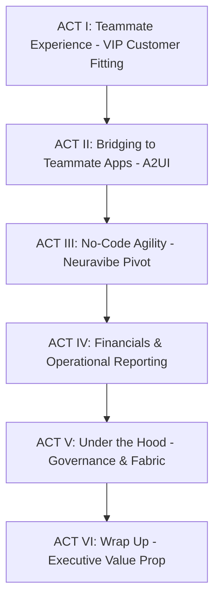

# DSG Presentation Script: Gemini Enterprise & Knowledge Fabric Demo

This document is a complete, step-by-step presentation script for the live demonstration to Dick's Sporting Goods (DSG). It showcases the front-end Gemini Enterprise app, low/no-code workflow builders, custom AI agents, the retail floor integration, and the under-the-hood GCP Data Architecture ("Knowledge Fabric").

> [!TIP]
> **🚀 GE APP INTERACTION REFERENCE:** Refer to [ge_app_interaction_script.md](file:///Users/mlakhavani/.gemini/jetski/brain/62dcd891-1c37-4752-a23b-de8dd401c78d/ge_app_interaction_script.md) for the exact chat prompts and simulated outputs to copy-paste during the live presentation of Act I and Act IV.

---

## Act-by-Act Live Presentation Script

---

### ACT I: Teammate Experience—VIP Customer Fitting (GE App)
**Focus:** Frame Gemini Enterprise (GE) App as the single entry point for teammates, and immediately run a live personalized shoe fitting using connected customer profile and wearable data.

| Presenter Action (DOING) | Spoken Narrative (SAYING) |
| :--- | :--- |
| **Open Browser Tab to the Gemini Enterprise App URL:** [Gemini Enterprise Home](https://vertexaisearch.cloud.google.com/home/cid/f8278d4b-7281-497b-bb8b-6faf01911774?hl=en_US) | *"Welcome everyone. Today, we're going to show you how Dick's Sporting Goods is transforming retail operations from the boardroom to the sales floor. What you're looking at right now is Gemini Enterprise—the single, governed entry point for all cognitive capabilities across your business."* |
| **Select the "DSG Enhanced VIP Customer Agent" in the panel.** | *"Imagine a DSG teammate standing in the footwear aisle. An athlete walks in looking for marathon shoes. Instead of sorting through complex legacy screens, the associate asks the VIP Customer Agent for assistance."* |
| **Type into the chat:** `I'm helping James Jones on the sales floor. He's looking for new running shoes. Based on his purchase history, running habits, and average daily steps from his fitness tracker, what specific model should I recommend and why?` | *"Notice what just happened. The teammate asked a natural, conversational question. Under the hood, the agent queried James's past shoe purchases in BigQuery, pulled his live Garmin step logs from Spanner, joined them through our property graph, and returned a structured recommendation. It suggests the Hoka Clifton 9 because James averages 12k steps a day and has a strong brand affinity for Hoka cushion models."* |

---

### ACT II: Bridging to Teammate Apps (A2UI)
**Focus:** Pivot to the mobile teammate UI (A2UI) to show how this backend knowledge fabric serves the user interface the associate uses on the floor.

| Presenter Action (DOING) | Spoken Narrative (SAYING) |
| :--- | :--- |
| **Switch Tabs to the A2UI Application URL:** [A2UI DSG App](https://nondescript-plane.surge.sh) | *"But a great associate experience doesn't live inside a chat window alone. Let's pull up the customer's profile in the DSG teammate app to see the visual dashboard matching this recommendation."* |
| **Search or navigate to the customer profile of "James Jones". Highlight his interests (Running, Fitness) and his Product Affinity.** | *"We load our customer profile app, and here is James Jones. We can see his loyalty status, his purchase history, and his interests. James loves running, and his product affinity shows he prefers premium cushioning shoes."* |
| **Reference the fitness tracking stats and order history on screen.** | *"Looking at James's history, he has active wearable logs from his fitness tracker. Based on James's affinity for cushioned models and his upcoming marathon goal, we can confidently confirm the Hoka Clifton recommendation for his training. That's data-driven, personalized selling on the floor."* |

---

### ACT III: No-Code Agility (The Environment Pivot)
**Focus:** Pivot to Neuravibe, showing how non-technical business teams can build custom comparison workflows without coding.

> [!IMPORTANT]
> **INTERNAL PRESENTATION NOTE:** You must switch accounts or environments to Neuravibe. Use credentials: **mlakhavani@demospace.altostrat.com** for project **GeminiEnterprise-da8bd** or the cloud-demo-hub fallback link.

| Presenter Action (DOING) | Spoken Narrative (SAYING) |
| :--- | :--- |
| **Switch Tabs to the Neuravibe App URL:** [Neuravibe Home](https://vertexaisearch.cloud.google.com/home/cid/8e21c7cd-cbfe-4162-baf4-3381fc43546e) | *"We've looked at structured customer recommendations. But what about your business analysts, retail operations team, or marketing group? How do we give them agility to build custom comparisons? Let's pivot to the Neuravibe sandbox, which gives business users a completely no-code Agent Designer."* |
| **Navigate to the 'Agent Designer' and create a prompt comparison agent.** | *"With the Agent Designer, any non-technical user can create a workflow agent. We just define the goal and upload a simple prompt: compare sports items based on specs and photos, and highlight technical differences."* |
| **In the Neuravibe Chat window, upload photos of two running shoes (e.g., Nike Vaporfly vs. Hoka Clifton).** *Ask the agent:* `I have an athlete training for their first marathon. Here are two shoes they are considering. Compare their features, weight, and suitability for marathon distances.` | *"Let's test this in a sales floor scenario. An athlete is torn between Hoka and Nike. The associate snaps photos of the shoes and asks our custom comparison agent. Within seconds, it returns a comparison showing that the Nike has a carbon plate built for speed, while the Hoka offers maximum cushioning for recovery. The teammate is instantly armed with expert product knowledge."* |

---

### ACT IV: Financials & Operational Reporting (GE App)
**Focus:** Switch to the DSG Financial Agent in the GE App to show how store managers query stock levels and run replenishment reports on the fly.

| Presenter Action (DOING) | Spoken Narrative (SAYING) |
| :--- | :--- |
| **Switch back to the Gemini Enterprise App, and select the "DSG Financial Agent".** | *"Now let's switch gears. What about the store managers running daily operations? Instead of pulling up legacy ERP systems or exporting to Excel, they use the DSG Financial Agent."* |
| **Type into the chat:** `Do we have the Nike Vaporfly in size 10 (Blue colorway) in stock here? If we are out, check if any stores in our state have it and give me their store names and quantities.` | *"The manager checks stock for a customer. The agent looks across the inventory database, sees we are out of stock locally, but instantly pulls the quantities and contact numbers for the nearest store in El Segundo. The manager can call and hold it in seconds."* |
| **Type into the chat:** `List all Nike and Hoka shoe models in our store that have less than 5 pairs in stock, along with their sizes, and recommend which ones need urgent replenishment based on popular sizes.` | *"At the end of the shift, the manager runs a weekly replenishment audit. Instead of digging through spreadsheet rows, the agent summarizes low-stock footwear and automatically recommends sizes that need ordering based on sales velocity. What used to take hours of manual review is now a 5-second question."* |

---

### ACT V: Under the Hood—Governance & Knowledge Fabric
**Focus:** Navigate into the Google Cloud Console, showcase the Agent Registry, observability/tracing, and show the "Knowledge Fabric" query travel across BigQuery and Spanner.

> [!NOTE]
> **INTERNAL PRESENTATION NOTE:** Ensure you are logged into your Google Cloud account with access to the `meera-demos` project before starting this segment.

| Presenter Action (DOING) | Spoken Narrative (SAYING) |
| :--- | :--- |
| **Switch Tabs to the Vertex AI Agent Registry Console:** [VIP Customer Agent Backend](https://console.cloud.google.com/bigquery/agents_hub;agentsHubTab=Agents;agentsPath=%2Fbq%2Fagents%2Fprojects%252Fmeera-demos%252Flocations%252Fglobal%252FdataAgents%252Fgda-ea030125-77ea-49d7-ab60-e89d451dbcd3?project=meera-demos) | *"Now, as IT directors and technology leaders, the first question is: 'How do we govern this?' Let's step behind the curtain. Here is our Agent Registry, where developers register, package, and govern custom data agents."* |
| **Click on the details of the agent configuration, highlighting the allowed dataset references and system instructions.** | *"This is where we define what data the agent can see, what tables it can touch, and the precise rules of engagement. No shadow-IT. Every prompt and database call is strictly bounded by enterprise IAM permissions."* |
| **Point to the Observability and Tracing tab in the console.** | *"In addition to governance, you get full observability. Every question asked by a store associate is logged. We can trace latency, monitor token usage, and see the exact queries generated in real-time. If an agent behaves unexpectedly, developers can audit the execution path instantly."* |
| **Switch Tabs to the Spanner and BigQuery Graph Console (or refer to the deployed graph schema in BigQuery).** | *"But the real magic lies in what we call the 'Knowledge Fabric.' Standard databases keep orders and customer profiles separated. But our graph database connects them. We've built a Property Graph that spans both BigQuery and Spanner. When the agent ran the James Jones query earlier, it didn't just lookup his profile—it traced his orders, store preferences, and fitness trackers through a single network of relationships."* |

---

### ACT VI: Wrap Up
**Focus:** Summarize business value, conversion metrics, and the power of the GCP Knowledge Fabric.

| Presenter Action (DOING) | Spoken Narrative (SAYING) |
| :--- | :--- |
| **Switch back to the main slides or display the Gemini Enterprise dashboard.** | *"What we've shown you today is a complete loop. By connecting BigQuery, Spanner, and Graph databases into a single 'Knowledge Fabric,' we enable custom developer agents for deep analytics, low-code designers for business teams, and mobile retail apps for associates on the floor."* |
| **Summarize key takeaways.** | *"For Dick's Sporting Goods, this means: 1. **Empowered Teammates:** Floor associates instantly become product and customer experts. 2. **Better Conversion:** Personalized shoe recommendations based on real customer health data. 3. **Full Governance:** Centralized IT control over all AI pipelines.  Thank you, and I'd love to open the floor to any questions."* |

---

## Deployed Conversational Reference Queries

For testing or presenting alternative scenarios, use these verified queries on the respective agent backends:

### DSG Financial Agent
*   **Backend URL:** [Financial Agent](https://console.cloud.google.com/bigquery/agents_hub;agentsHubTab=Agents;agentsPath=%2Fbq%2Fagents%2Fprojects%252Fmeera-demos%252Flocations%252Fglobal%252FdataAgents%252Fgda-731cca2e-0d1b-41bb-8fe0-e2c105208826?project=meera-demos)
*   **Test Query 1 (Local Stock Sizing):** `Do we have the Nike Vaporfly in size 10 (Blue colorway) in stock here? If we are out, check if any stores in our state have it and give me their store names and quantities.`
*   **Test Query 2 (Replenishment Warning):** `List all Nike and Hoka shoe models in our store that have less than 5 pairs in stock, along with their sizes, and recommend which ones need urgent replenishment based on popular sizes.`

### DSG Enhanced VIP Agent (Graph-based)
*   **Backend URL:** [Graph Agent](https://console.cloud.google.com/bigquery/agents_hub;agentsHubTab=Agents;agentsPath=%2Fbq%2Fagents%2Fprojects%252Fmeera-demos%252Flocations%252Fglobal%252FdataAgents%252Fgda-13b505cd-5cf9-414b-ba5f-da162d90cb10?project=meera-demos)
*   **Test Query 1 (Personalized Recommendation):** `I'm helping James Jones on the sales floor. He's looking for new running shoes. Based on his purchase history, running habits, and average daily steps from his fitness tracker, what specific model should I recommend and why?`
*   **Test Query 2 (Receipt-less Return):** `James Jones wants to return a pair of shoes but does not have his receipt. Can you find his most recent shoe purchase, including the SKU, transaction date, price paid, and store location?`
